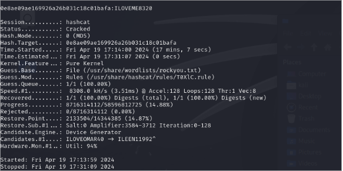
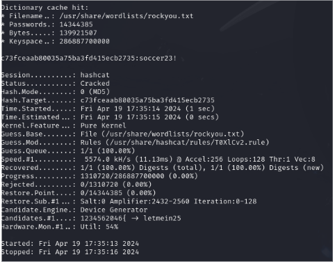
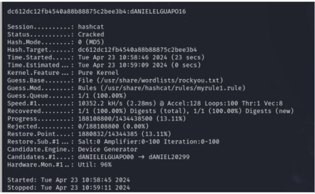

# REPORT LAB 2

> - Enrico Ferraiolo 0001020254 enrico.ferraiolo2@studio.unibo.it
> - Simone Folli 0000974629 simone.folli2@studio.unibo.it
> - Gianlorenzo Urbano 0001020458 gianlorenzo.urbano@studio.unibo.it

## Exercise 1

Hash n.1: `6e6bc4e49dd477ebc98ef4046c067b5f`

We executed `sudo rtgen md5 loweralpha 1 7 0 1000 100000 0`

We then sorted with `sudo rtsort /usr/share/rainbowcrack`

The plaintext found is `ciao`.


<hr>

Hash n.2: `427ade9c15ec643751860eba9899355b`

We increased the chains from 100000 to 900000: `sudo rtgen md5 loweralpha 1 7 0 1000 900000 0`

We sorted with `sudo rtsort /usr/share/rainbowcrack`

We then executed `rcrack /usr/share/rainbowcrack -h 427ade9c15ec643751860eba9899355b`

The plaintext found is `gatto`.


## Exercise 2

Hash n.1:  `6c00f2d6e1610bfc9b415daf80d45855f2c56443c2dc2f71e7ef27168d1f2857d6168f4d374ed8eca349f2debd18d4ccac339218ca70446adf999060395742b4`
Salt: `hjt88q`

We executed the command `hashcat -a 0 -m 1710 "6c00f2d6e1610bfc9b415daf80d45855f2c56443c2dc2f71e7ef27168d1f2857d6168f4d374ed8eca349f2debd18d4ccac339218ca70446adf999060395742b4:hjt88q" /usr/share/wordlists/rockyou.txt `

The plaintext found is `markinho`


## Exercise 3

Hash n.1: `0e8ae09ae169926a26b031c18c01bafa`

> HINT: It contains a phrase without spaces and some numbers at the end

We used `hashid` to uncover what type of hash we are dealing with

We then used `hashcat -a 0 -m 0 -r /usr/share/hashcat/rules/T0XlC.rule "0e8ae09ae169926a26b031c18c01bafa" /usr/share/wordlists/rockyou.txt`

The plaintext found is `ILOVEME8320`.



<hr>

Hash n.2: `c73fceaab80035a75ba3fd415ecb2735`

> HINT: it contains, in order: a commond word, some numbers and a special character

With the same steps as before, we found the type of the hash (MD5).

We then used `hashcat -a 0 -m 0 -r /usr/share/hashcat/rules/T0XlCv2.rule "c73fceaab80035a75ba3fd415ecb2735" /usr/share/wordlists/rockyou.txt`

The plaintext found is `soccer23!`.



Hash n.3: `dc612dc12fb4540a88b88875c2bee3b4`

> HINT: it contains, in order: a commond word and one or two numbers. The commond word has the case iNVERTED.

To crack this hash we generate a new rule file in the rules directory. (`nano /usr/share/hashcat/rules/myrule1.rule`)

The new rules are the following: 

```bash
C $0 $0
C $0 $1
C $0 $2
C $0 $3
C $0 $4
C $0 $5
C $0 $6
C $0 $7
C $0 $8
C $0 $9
C $1 $0
C $1 $1
C $1 $2
C $1 $3
C $1 $4
C $1 $5
C $1 $6
C $1 $7
C $1 $8
C $1 $9
C $2 $0
C $2 $1
C $2 $2
C $2 $3
C $2 $4
.
.
.
C $9 $7
C $9 $8
C $9 $9
```

We then used `hashcat -a 0 -m 0 -r /usr/share/hashcat/rules/myrule1.rule "dc612dc12fb4540a88b88875c2bee3b4" /usr/share/wordlists/rockyou.txt`

After some minutes the plaintext found is `dANIELELGUAPO16`.



# Bandit Game

## Level 0

We simply connected to the ssh server with the given address, user and port.

## Level 0 -> 1

We used the `ls` command to list the home directory files, then `cat readme` to read the contents of the readme file.

## Level 1 -> 2

We again used the `ls` command to find the files in the home directory, then `cat ./-` to read the contents of the - file.

> Note: we coulnd't just use `cat -` because the `-` char is used to pass flags to linux commands.

## Level 2 -> 3

Once again, the `ls` command. Then `cat ./spaces\ in\ this\ filename`.

> Note: the whitespace character must be escaped with \.

## Level 3 -> 4

We changed directory with `cd inhere` command, then we listed ALL of the directory contents (included the hidden files) with `ls -la`. When then got the password from the `.hidden` file with `cat .hidden`.

## Level 4 -> 5

We changed dir to `inhere` with `cd inhere`, then we listed all the directory contents with `ls`.

To print all the contents of the files, we used `cat ./-file0*`.

> Note: `cat *` couldn't be used because all of the files begin with -.

## Level 5 -> 6

We use a pretty convoluted command to find the password in this stage, to avoid having to "cd ls cd .. cat" everything...

We first use the `man du` to check if there are any options to see both all of the files in the directory tree and to list its size in bytes (`du -ba`).

We then pipe the output into an `awk` command to check if the first element printed (the bites in size) is equal to 1033. Then we printed the file contents with the `cat` command.

`du -ab | awk '{if ($1 == 1033) print}'`

## Level 6 -> 7

We  `cd ../..` to go in the server base dir, then `find -group bandit6 -user bandit7` to list all the files owned by user bandit7 and group bandit6, finding only one file.

## Level 7 -> 8

We use the `cat data.txt` to list the contents of the file, then we pipe the output to an awk function that prints the line only if the first element is "millionth".

`cat data.txt | awk '{ if ($1 == "millionth") print}'`

## Level 8 -> 9

We pipe the output of the `cat` command to `sort`, then to `uniq -c` (to also print the count). The password is the only line that appears once.

`cat data.xt | sort | uniq -c`

## Level 9 -> 10

We use the `strings data.txt` to list all the lines that contain human readable chars, then we pipe the output to `grep "===*"` to only print lines that have at least 2 equal signs.

`strings data.txt | grep "===*"`

 (the pass for the next level is `G7w8LIi6J3kTb8A7j9LgrywtEUlyyp6s` but i dont know if we have to do it)


