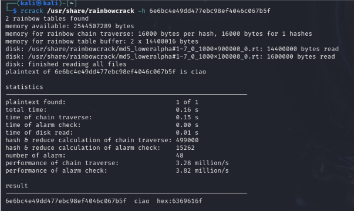
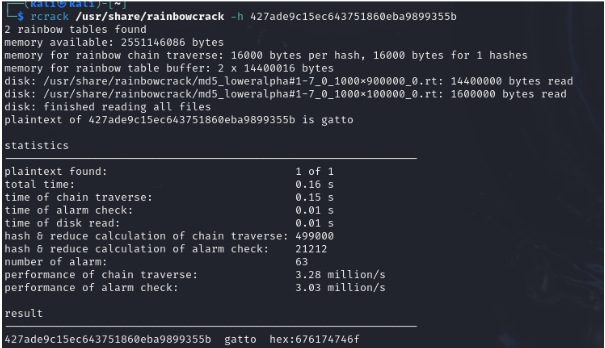
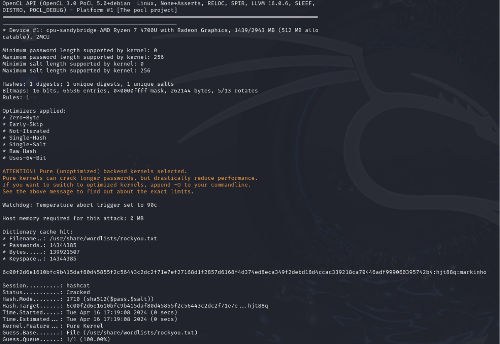

# RELAZIONE LABORATORIO 2

> - Enrico Ferraiolo 0001020254 enrico.ferraiolo2@studio.unibo.it
> - Simone Folli 0000974629 simone.folli2@studio.unibo.it
> - Gianlorenzo Urbano 0001020458 gianlorenzo.urbano@studio.unibo.it

## Esercizio 1

Hash n.1: `6e6bc4e49dd477ebc98ef4046c067b5f`

We executed `sudo rtgen md5 loweralpha 1 7 0 1000 100000 0`

We then sorted with `sudo rtsort /usr/share/rainbowcrack`

The plaintext found is `ciao`.

Hash n.2: `427ade9c15ec643751860eba9899355b`

We increased the chains from 100000 to 900000: `sudo rtgen md5 loweralpha 1 7 0 1000 900000 0`

We sorted with `sudo rtsort /usr/share/rainbowcrack`

We then executed `rcrack /usr/share/rainbowcrack -h 427ade9c15ec643751860eba9899355b`

The plaintext found is `gatto`.

## Esercizio 2

Hash n.1:  `6c00f2d6e1610bfc9b415daf80d45855f2c56443c2dc2f71e7ef27168d1f2857d6168f4d374ed8eca349f2debd18d4ccac339218ca70446adf999060395742b4`
Salt: `hjt88q`

We executed the command `hashcat -a 0 -m 1710 "6c00f2d6e1610bfc9b415daf80d45855f2c56443c2dc2f71e7ef27168d1f2857d6168f4d374ed8eca349f2debd18d4ccac339218ca70446adf999060395742b4:hjt88q" /usr/share/wordlists/rockyou.txt `

The plaintext found is `markinho`

## Esercizio 3

